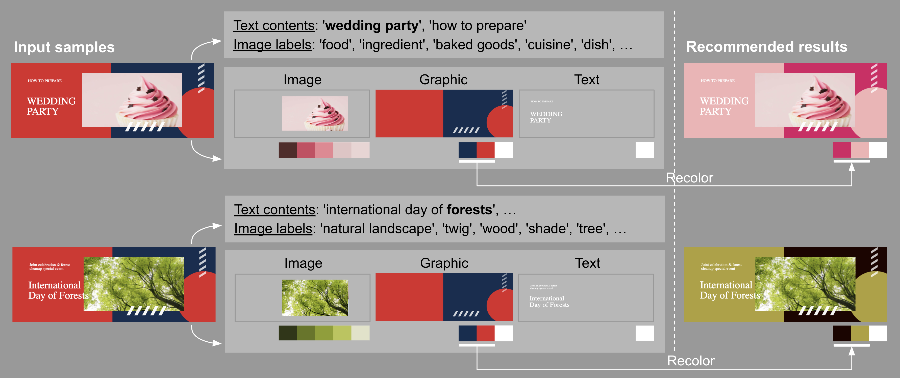
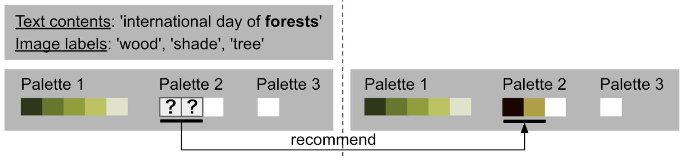
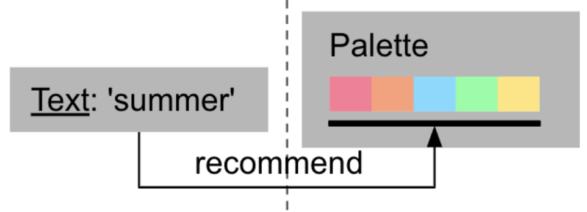

# Text-aware Color recommendation for vector graphic documents 

Official implementation of [Multimodal Color Recommendation in Vector Graphic Documents, ACM MM 2023](https://arxiv.org/abs/2308.04118)



## Prerequisites

- Python:3.8
- Poetry: 1.2.*

## Setup

This project has been developed and tested in a Google Cloud Platform (GCP) notebook instance, utilizing TensorFlow 2.3 environment and a NVIDIA T4 GPU.

If run locally, please try to install requirements and run jupyter.

```
poetry install
poetry run jupyter lab
```

## Color palette completion

Task: Recommends colors based on the given colors and text

Target: multiple palettes in a graphic document



### Quick demo

`color_palette_completion/`

`notebooks/palette_compl.ipynb`: recommend colors for multiple palettes in a design
- Trained model of color prediction are in data/trained_models/.
- Json files for test are pre-created in data/samples/crello_samples/.
- New input image files for test are in data/samples/image_samples/.

You can also create a json file for test from crello dataset on a notebook `notebooks/create_json_file.ipynb`.

### Train models

Train a color model on a notebook `notebooks/train_model.ipynb`.

### Data

`data/data_colors/data_colors_labels/.`: extracted color palettes for Image-SVG-Text elements, text contents and image lables from [Crello-dataset-v2](https://storage.cloud.google.com/ailab-public/canvas-vae/crello-dataset-v2.zip) ([the lastest Crello-dataset](https://github.com/CyberAgentAILab/canvas-vae/blob/main/docs/crello-dataset.md))
- Data filter: high frequent image labels, English contents

`data/data_t2p/Data_color`: color corpus of train, validation, and test dataset, and color vocabulary from train dataset

`data/data_t2p/Data_text`: text contents and image labels of train, validation, and test dataset

`data/data_t2p/Data_text/emb_clip_imagemust_seq`: pre-created text embedings of text contents and image labels for train, validation, and test

`data/trained_model`: trained model for text-aware color completion

`data/samples`: json sample files for testing the results of color completion

## Full palette completion

Task: Generates a complete color palette corresponding to the given text

Target: A single palette for an image



### Quick demo

`full_palette_generation/`

`notebooks/palette_gen.ipynb`: recommend colors for a given text
- Trained model of color generation are in data/trained_models/.

### Train models

Train a color model on a notebook `notebooks/train_model.ipynb`.

### Data

`data/data_colors/.`: palette-text pairs for train, validation, and test from [Palette-And-Text dataset](https://github.com/awesome-davian/Text2Colors)

`data/data_t2p/Data_color`: color corpus of train, validation, and test dataset, and color vocabulary from train dataset

`data/data_t2p/Data_text`: text input of train, validation, and test dataset

`data/data_t2p/Data_text/emb_clip`: pre-created text embedings of text contents and image labels for train, validation, and test

`data/trained_model`: trained model for text-aware palette generation

## Citation

```bibtex
@misc{Qiu_2023,
  author = {Qiu Qianru, Wang Xueting, Otani Mayu},
  title = {Multimodal Color Recommendation in Vector Graphic Documents},  
  doi = {10.48550/ARXIV.2308.04118},  
  url = {https://arxiv.org/abs/2308.04118},  
  year = {2023},
}
```
